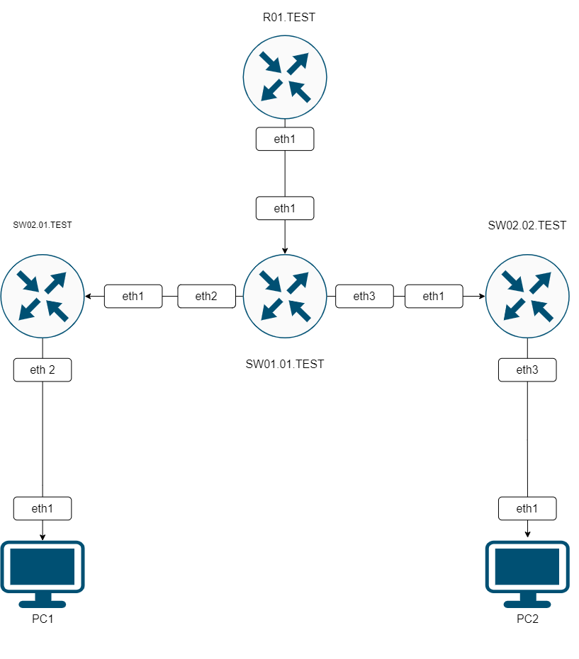
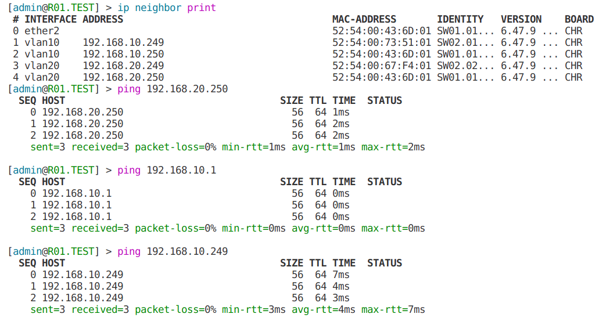

University: [ITMO University](https://itmo.ru/ru/)
Faculty: [FICT](https://fict.itmo.ru)
Course: [Introduction in routing](https://github.com/itmo-ict-faculty/introduction-in-routing)
Year: 2022/2023
Group: K33202
Author: Malkov Evgeny Vitalevich
Lab: Lab1
Date of create: 20.09.2022
Date of finished: 04.11.2022

## Отчёт по лабораторной работе №1 "Установка ContainerLab и развертывание тестовой сети связи"

**Цель работы**: Ознакомиться с инструментом ContainerLab и методами работы с ним, изучить работу VLAN, IP адресации и т.д.

**Артефакты выполнения**

1. Полный текст топологии сети:

```
name: lab1

mgmt:
network: Network
ipv4_subnet: 172.25.25.0/24

topology:
nodes:
R01.TEST:
kind: vr-ros
image: vrnetlab/vr-routeros:6.47.9
mgmt_ipv4: 172.25.25.2

    SW01.01.TEST:
      kind: vr-ros
      image: vrnetlab/vr-routeros:6.47.9
      mgmt_ipv4: 172.25.25.3

    SW02.01.TEST:
      kind: vr-ros
      image: vrnetlab/vr-routeros:6.47.9
      mgmt_ipv4: 172.25.25.4

    SW02.02.TEST:
      kind: vr-ros
      image: vrnetlab/vr-routeros:6.47.9
      mgmt_ipv4: 172.25.25.5

    PC1:
      kind: linux
      image: ubuntu:latest
      mgmt_ipv4: 172.25.25.6

    PC2:
      kind: linux
      image: ubuntu:latest
      mgmt_ipv4: 172.25.25.7

links:
- endpoints: ["R01.TEST:eth1", "SW01.01.TEST:eth1"]
- endpoints: ["SW01.01.TEST:eth2", "SW02.01.TEST:eth1"]
- endpoints: ["SW01.01.TEST:eth3", "SW02.02.TEST:eth1"]
- endpoints: ["SW02.01.TEST:eth2", "PC1:eth1"]
- endpoints: ["SW02.02.TEST:eth2", "PC2:eth1"]

```

2. Схема связи:
   
3. Тексты конфигурации для сетевых устройств.

- Главный маршрутизатор R01.TEST

```
/interface vlan
add interface=ether2 name=vlan10 vlan-id=10
add interface=ether2 name=vlan20 vlan-id=20
/interface wireless security-profiles
set [ find default=yes ] supplicant-identity=MikroTik
/ip pool
add name=pool1 ranges=192.168.10.10-192.168.10.250
add name=pool2 ranges=192.168.20.10-192.168.20.250
/ip dhcp-server
add address-pool=pool1 disabled=no interface=vlan10 name=server1
add address-pool=pool2 disabled=no interface=vlan20 name=server2
/ip address
add address=172.31.255.30/30 interface=ether1 network=172.31.255.28
add address=192.168.10.1/24 interface=vlan10 network=192.168.10.0
add address=192.168.20.1/24 interface=vlan20 network=192.168.20.0
/ip dhcp-client
add disabled=no interface=ether1
/ip dhcp-server network
add address=192.168.10.0/24 gateway=192.168.10.1
add address=192.168.20.0/24 gateway=192.168.20.1
/system identity
set name=R01.TEST
```

- Маршрутизатор первого уровня. SW01.01.TEST

```
/interface bridge
add name=bridge
add name=bridge10
add name=bridge20
/interface vlan
add interface=ether2 name=vlan10 vlan-id=10
add interface=ether2 name=vlan20 vlan-id=20
add interface=ether3 name=vlan103 vlan-id=10
add interface=ether4 name=vlan203 vlan-id=20
/interface wireless security-profiles
set [ find default=yes ] supplicant-identity=MikroTik
/interface bridge port
add bridge=bridge interface=ether2
add bridge=bridge10 interface=vlan10
add bridge=bridge10 interface=vlan103
add bridge=bridge20 interface=vlan20
add bridge=bridge20 interface=vlan203
/ip address
add address=172.31.255.30/30 interface=ether1 network=172.31.255.28
/ip dhcp-client
add disabled=no interface=ether1
add disabled=no interface=bridge10
add disabled=no interface=bridge20
/system identity
set name=SW01.01.TEST
```

- Первый маршрутизатор 2 уровня. SW02.01.TEST

```
/interface bridge
add name=bridge10
/interface vlan
add interface=ether2 name=vlan10 vlan-id=10
/interface wireless security-profiles
set [ find default=yes ] supplicant-identity=MikroTik
/interface bridge port
add bridge=bridge10 interface=vlan10
add bridge=bridge10 interface=ether3
/ip address
add address=172.31.255.30/30 interface=ether1 network=172.31.255.28
/ip dhcp-client
add disabled=no interface=ether1
add disabled=no interface=bridge10
/system identity
set name=SW02.01.TEST
```

\*Второй маршрутизатор 2 уровня. SW02.02.TEST

```
/interface bridge
add name=bridge20
/interface vlan
add interface=ether2 name=vlan20 vlan-id=20
/interface wireless security-profiles
set [ find default=yes ] supplicant-identity=MikroTik
/interface bridge port
add bridge=bridge20 interface=vlan20
add bridge=bridge20 interface=ether3
/ip address
add address=172.31.255.30/30 interface=ether1 network=172.31.255.28
/ip dhcp-client
add disabled=no interface=ether1
add disabled=no interface=bridge20
/system identity
set name=SW02.02.TEST
```

4. Результаты пингов, проверки локальной связности.
   

**Выводы**: Выполнив данную работу я ознакомился с инструментом ContainerLab и методами работы с ним, изучил работу VLAN, IP адресации.
