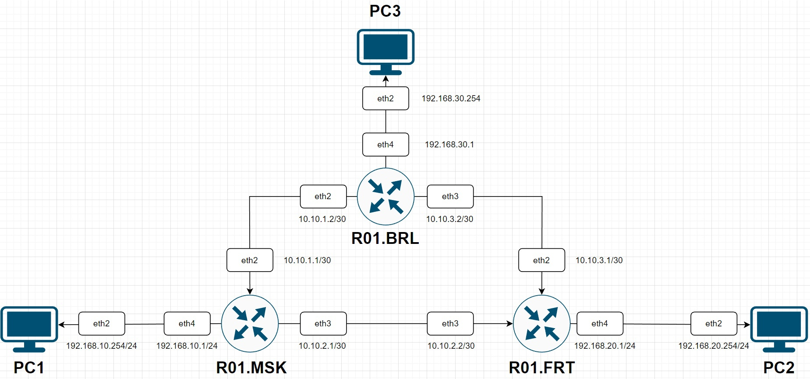
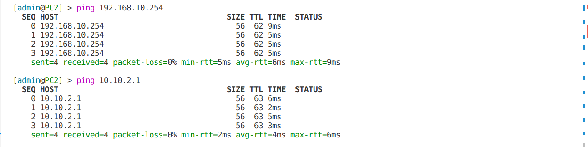
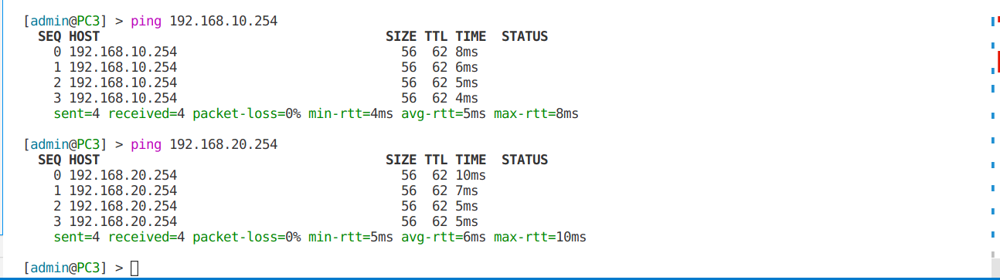

University: [ITMO University](https://itmo.ru/ru/)

Faculty: [FICT](https://fict.itmo.ru)

Course: [Introduction in routing](https://github.com/itmo-ict-faculty/introduction-in-routing)

Year: 2022/2023

Group: K33202

Author: Malkov Evgeny Vitalevich

Lab: Lab2

Date of create: 13.11.2022

Date of finished: 15.11.2022

## Отчёт по лабораторной работе №2 "Эмуляция распределенной корпоративной сети связи, настройка статической маршрутизации между филиалами"

---

**Цель работы**: Ознакомиться с принципами планирования IP адресов, настройке статической маршрутизации и сетевыми функциями устройств.

**Артефакты выполнения**

1. Полный текст топологии сети:

```
name: lab2

mgmt:
  network: statics
  ipv4_subnet: 172.20.21.0/24

topology:
  nodes:
    R01.MSK:
      kind: vr-mikrotik_ros
      image: vrnetlab/vr-routeros:6.47.9
      mgmt_ipv4: 172.20.21.2

    R01.FRT:
      kind: vr-mikrotik_ros
      image: vrnetlab/vr-routeros:6.47.9
      mgmt_ipv4: 172.20.21.3

    R01.BRL:
      kind: vr-mikrotik_ros
      image: vrnetlab/vr-routeros:6.47.9
      mgmt_ipv4: 172.20.21.4

    PC1:
      kind: vr-mikrotik_ros
      image: vrnetlab/vr-routeros:6.47.9
      mgmt_ipv4: 172.20.21.5

    PC2:
      kind: vr-mikrotik_ros
      image: vrnetlab/vr-routeros:6.47.9
      mgmt_ipv4: 172.20.21.6

    PC3:
      kind: vr-mikrotik_ros
      image: vrnetlab/vr-routeros:6.47.9
      mgmt_ipv4: 172.20.21.7

  links:
    - endpoints: ["R01.BRL:eth3", "PC3:eth1"]
    - endpoints: ["R01.FRT:eth3", "PC2:eth1"]
    - endpoints: ["R01.MSK:eth3", "PC1:eth1"]
    - endpoints: ["R01.BRL:eth2", "R01.FRT:eth1"]
    - endpoints: ["R01.FRT:eth2", "R01.MSK:eth2"]
    - endpoints: ["R01.MSK:eth1", "R01.BRL:eth1"]
```

2. Схема связи
   
3. Тексты конфигурации для сетевых устройств.

- Роутер MSK

```
/interface wireless security-profiles
set [ find default=yes ] supplicant-identity=MikroTik
/ip pool
add name=pool1 ranges=192.168.10.10-192.168.10.254
/ip dhcp-server
add address-pool=pool1 disabled=no interface=ether4 name=dhcp1
/ip address
add address=172.31.255.30/30 interface=ether1 network=172.31.255.28
add address=10.10.1.1/30 interface=ether2 network=10.10.1.0
add address=10.10.2.1/30 interface=ether3 network=10.10.2.0
add address=192.168.10.1/24 interface=ether4 network=192.168.10.0
/ip dhcp-client
add disabled=no interface=ether1
/ip route
add distance=1 dst-address=192.168.20.0/24 gateway=10.10.2.2
add distance=1 dst-address=192.168.30.0/24 gateway=10.10.1.2
/system identity
set name=R01.MSK
```

- Роутер FRT

```
/interface wireless security-profiles
set [ find default=yes ] supplicant-identity=MikroTik
/ip pool
add name=pool2 ranges=192.168.20.10-192.168.20.254
/ip dhcp-server
add address-pool=pool2 disabled=no interface=ether4 name=dhcp2
/ip address
add address=172.31.255.30/30 interface=ether1 network=172.31.255.28
add address=10.10.2.2/30 interface=ether3 network=10.10.2.0
add address=10.10.3.1/30 interface=ether2 network=10.10.3.0
add address=192.168.20.1/24 interface=ether4 network=192.168.20.0
/ip dhcp-client
add disabled=no interface=ether1
/ip route
add distance=1 dst-address=192.168.10.0/24 gateway=10.10.2.1
add distance=1 dst-address=192.168.30.0/24 gateway=10.10.3.2
/system identity
set name=R01.FRT
```

- Роутер BRL

```
/interface wireless security-profiles
set [ find default=yes ] supplicant-identity=MikroTik
/ip pool
add name=pool3 ranges=192.168.30.10-192.168.30.254
/ip dhcp-server
add address-pool=pool3 disabled=no interface=ether4 name=dhcp3
/ip address
add address=172.31.255.30/30 interface=ether1 network=172.31.255.28
add address=10.10.1.2/30 interface=ether2 network=10.10.1.0
add address=10.10.3.2/30 interface=ether3 network=10.10.3.0
add address=192.168.30.1/24 interface=ether4 network=192.168.30.0
/ip dhcp-client
add disabled=no interface=ether2
/ip route
add distance=1 dst-address=192.168.10.0/24 gateway=10.10.1.1
add distance=1 dst-address=192.168.20.0/24 gateway=10.10.3.1
/system identity
set name=R01.BRL
```

- PC1

```
/interface wireless security-profiles
set [ find default=yes ] supplicant-identity=MikroTik
/ip address
add address=172.31.255.30/30 interface=ether1 network=172.31.255.28
/ip dhcp-client
add disabled=no interface=ether1
add disabled=no interface=ether2
/ip route
add distance=1 dst-address=10.10.1.0/30 gateway=192.168.10.1
add distance=1 dst-address=10.10.2.0/30 gateway=192.168.10.1
add distance=1 dst-address=192.168.20.0/24 gateway=192.168.10.1
add distance=1 dst-address=192.168.30.0/24 gateway=192.168.10.1
/system identity
set name=PC1
```

- PC2

```
/interface wireless security-profiles
set [ find default=yes ] supplicant-identity=MikroTik
/ip address
add address=172.31.255.30/30 interface=ether1 network=172.31.255.28
/ip dhcp-client
add disabled=no interface=ether1
add disabled=no interface=ether2
/ip route
add distance=1 dst-address=10.10.2.0/30 gateway=192.168.20.1
add distance=1 dst-address=10.10.3.0/30 gateway=192.168.20.1
add distance=1 dst-address=192.168.10.0/24 gateway=192.168.20.1
add distance=1 dst-address=192.168.30.0/24 gateway=192.168.20.1
/system identity
set name=PC2
```

- PC3

```
/interface wireless security-profiles
set [ find default=yes ] supplicant-identity=MikroTik
/ip address
add address=172.31.255.30/30 interface=ether1 network=172.31.255.28
/ip dhcp-client
add disabled=no interface=ether1
add disabled=no interface=ether2
/ip route
add distance=1 dst-address=10.10.1.0/30 gateway=192.168.30.1
add distance=1 dst-address=10.10.3.0/30 gateway=192.168.30.1
add distance=1 dst-address=192.168.10.0/24 gateway=192.168.30.1
add distance=1 dst-address=192.168.20.0/24 gateway=192.168.30.1
/system identity
set name=PC3
```

4. Результаты пингов, проверки локальной связности.
   
   
   **Выводы**: Выполнив данную работу я ознакомился c принципами планирования IP адресов, настройке статической маршрутизации и сетевыми функциями устройств.
